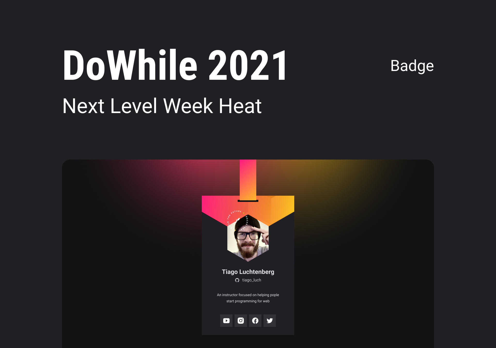
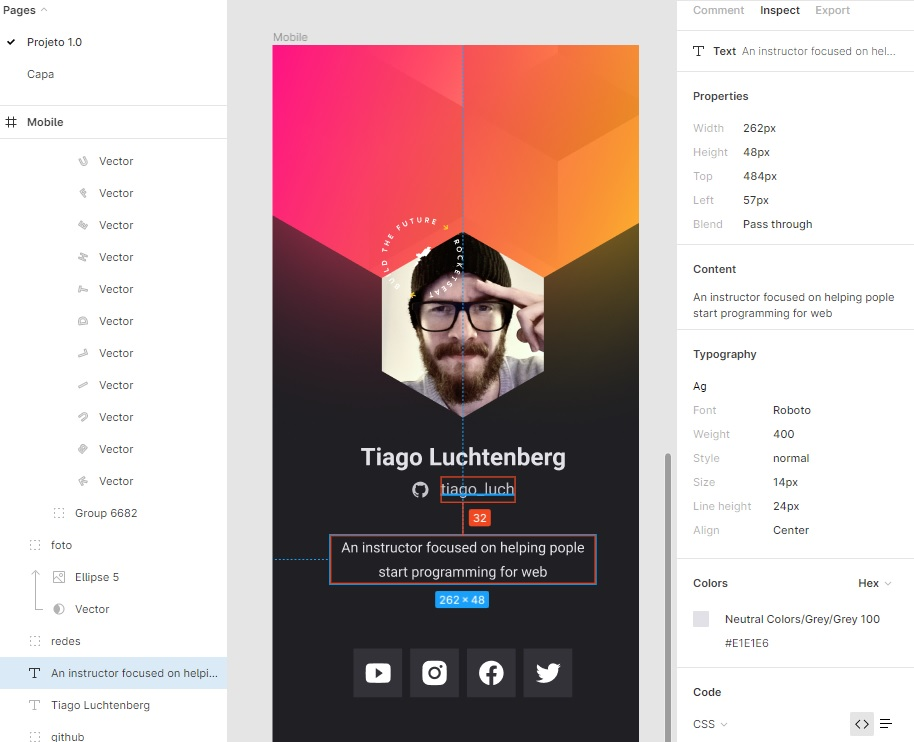
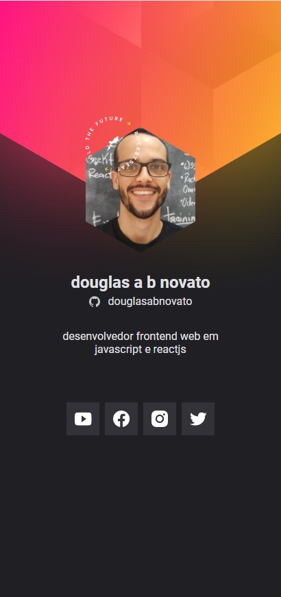
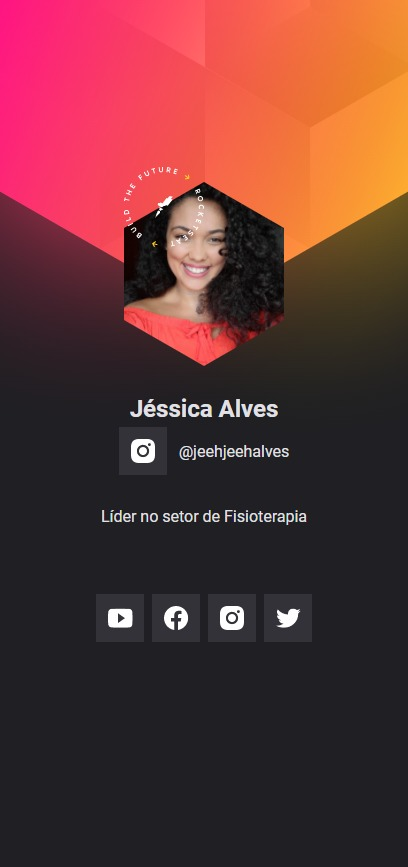
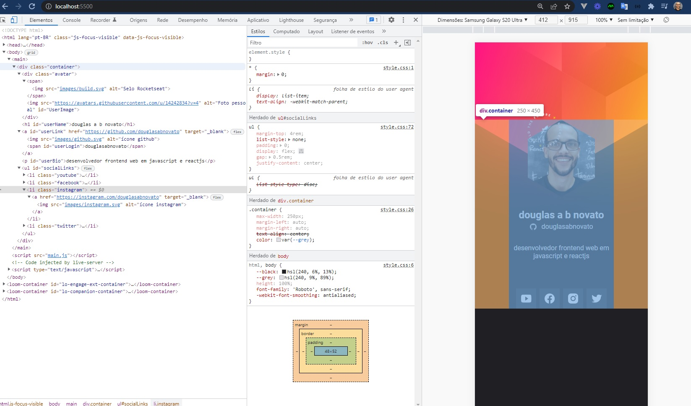

<h1 align="center">
  Crachá Virtual
</h1>

  <a href="#-tecnologias">Tecnologias</a>&nbsp;&nbsp;&nbsp;|&nbsp;&nbsp;&nbsp;
  <a href="#-projeto">Projeto</a>&nbsp;&nbsp;&nbsp;|&nbsp;&nbsp;&nbsp;
  <a href="#-layout">Layout</a>&nbsp;&nbsp;&nbsp;|&nbsp;&nbsp;&nbsp;
  <a href="#memo-licença">Licença</a>

  
  

 

  

## 🚀 Tecnologias

Esse projeto foi desenvolvido com as seguintes tecnologias:

- HTML
- CSS
- JavaScript
- API GitHub

## 💻 Projeto

O Crachá virtual DoWhile é uma aplicação estatica com o objetivo de mostrar as informações do usuário trazidas do GitHub API e inseri-lás em um layout com a cara do evento DoWhile 2021 

## 🔖 Layout

Você pode visualizar o layout do projeto através [desse link](https://www.figma.com/file/9Z2vxc8VTRuZpYjFalCMAl/Badge-Do-While2021-(Copy)?node-id=0%3A1). É necessário ter conta no [Figma](https://figma.com) para acessá-lo.

Utilizar o figma para pegar os detalhes do projeto e então, criar a estilização fiel ao projeto.

  

Alterado uma versão para o @douglasabnovato.

  
  
  

## 💻 Detalhes na construção do Projeto

- [x] stage 1

- [x] Abertura além do código
- impulsionar a carreira com uma metodologia que envolve consistência, foco, comunidade (discord)
- o mercado oferece oportunidades local e global
- desenvolver um projeto pessoal que expor os projetos de tutoriais em formato de loja virtual
- mentalidade é dedicar tempo de qualidade para: focar em quanto estiver programando, estudando e descansando.
- descanso de qualidade é importante no resultado
- persistência. "Não é praticar até acertar. É praticar até não errar mais."
- programar é encontrar soluções.
- programação: algoritmo, lógica de programação, sintaxe
- linguagem de programação: frontend, javascript

- estrutura do html
- Google Chrome: Inspecionar Código (F12)
- Google Chrome: Debbugar Código
- Extensão Live Server no VSCode para rodar um servidor
- formatação do css: Cascading Style Sheets

- [ ] stage 2
- o que é html: hyper text markup language, ou seja, linguagem de marcação de texto
- a tag e anatomia: tags, atributos, valores de atributos, conteúdo de tag
- alinhamento do html
- processo de aprendizado: learn by doing (aprender fazendo), learn by concepts (aprender conceitos e depois fazer)
- especificidade do css: inline css > id selector > class, pseudo class, attribute selector > element selector
- unidade de medida e responsividade
- box model: content(height x width) > padding > border > margin
- layout
- usar o figma para consultar os detalhes do layout e criar a estilização fiel ao projeto
- como identificar os elementos no figma para serem criados no nosso projeto e estruturados em html
- html/body/main/container/avatar/img selo|img foto
- objetos aleatórios para construir primeiro esboço: images: http://lorempixel.com.br/185/185/people/, texts: https://www.lipsum.com/
- html, body, main, container: configurando elementos 
- font google: Roboto: regular 400, bold 700. Três tag link. Então, `font-family: 'Roboto', sans-serif;`
- converter pixel(px) em rem: valor em px / 16
- parâmetros: top right bottom left || top left+right bottom || top+bottom left+right
- ferramenta de formas Css clip-path maker: construir o polígono da imagem foto: propriedade css `clip-path: polygon(values)` com os valores consultados nesse link

- [ ] stage 3
- [ ] stage 4
- [ ] stage 5

## :memo: Licença

Esse projeto está sob a licença MIT. Veja o arquivo [LICENSE](.github/LICENSE.md) para mais detalhes.

---  

Feito com ❤️ por Douglas A B Novato 👋🏽 [Entre em contato!](https://www.linkedin.com/in/douglasabnovato/) 
Fonte do projeto Por Rocketseat no [Next Level Week Heat](https://nextlevelweek.com/)
